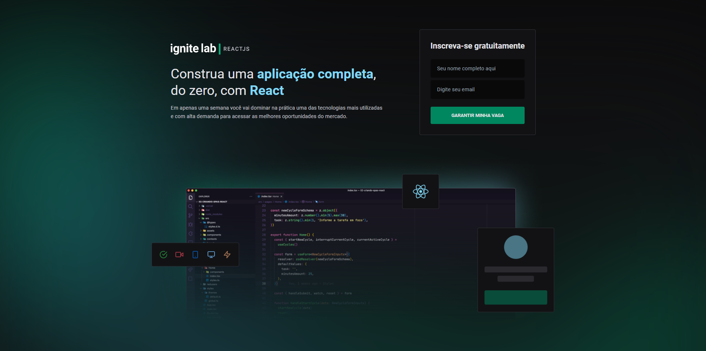
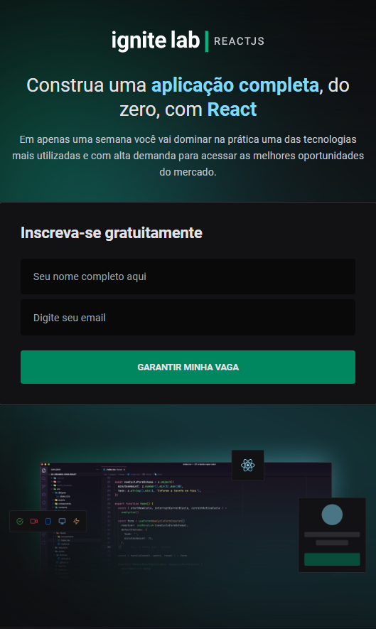
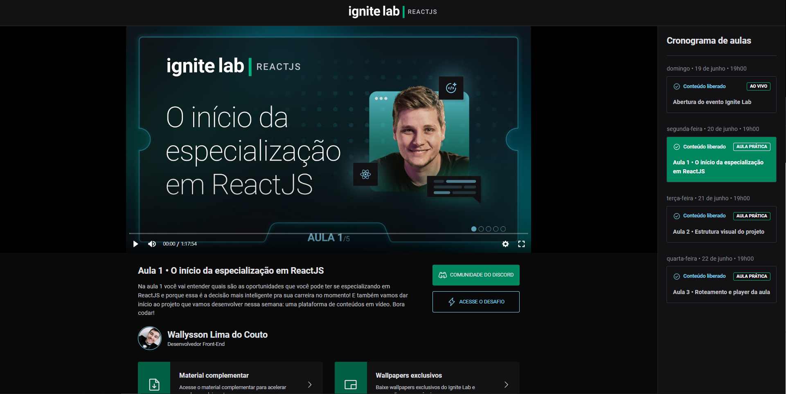
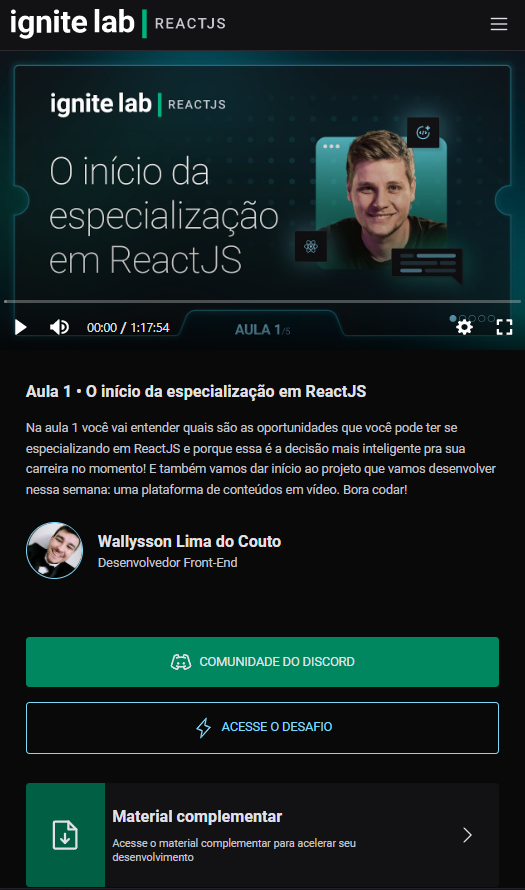
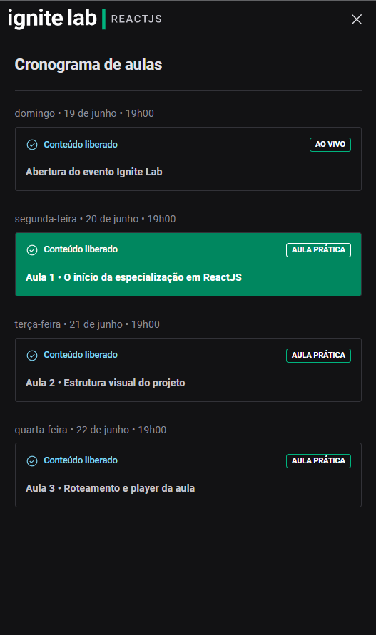

  
  

# 💻 Plataforma Ignite Lab

Projeto feito na semana do Ignite Lab da @rocketseat. O projeto tinha que criar um página home onde o usuário cadastra o email e vai direto para a tela de Eventos.
Foram utilizados: ReactJS, Tailwind, Graphql, Apollo, TypeScript, Deploy Vercel

- <a href="https://plataform-ignite-lab.vercel.app/" target="_blank">Deploy (Vercel)</a>
- <a href="https://www.figma.com/file/tIqkWLqWDJqCEM6bVNu8xe/Plataforma-de-evento---Ignite-Lab-(Community)?node-id=0%3A1" target="_blank">Layout Figma</a>
- [Tecnologias](#tecnologias)
- [Desafios](#desafios)
- [Previews](#previews)

# 🚀 Tecnologias

- [ReactJS](https://reactjs.org/)
- [TypeScript](https://www.typescriptlang.org/)
- [Tailwind](https://tailwindcss.com/)
- [Graphql](https://graphql.org/)
- [Apollo](https://www.apollo.io/)

# 📑 Desafios

- Responsividade no projeto. ✔️
- Menu dropdown na header para dispositivos mobiles. ✔️

# Previews

  

    <figure>
      
      <figcaption>Tela inicial do Ignite Lab</figcaption>
    </figure>
  

  

    <figure>
      
       
      <figcaption>Tela inicial do Ignite Lab</figcaption>
      </figure>
  

  
  

    <figure>
      
       
      <figcaption>Eventos do Ignite Lab</figcaption>
      </figure>
  

  
   

    <figure>
      
       
      <figcaption>Versão mobile da tela de eventos</figcaption>
      </figure>
  

  

    <figure>
      
       
      <figcaption>Versão mobile do menu</figcaption>
      </figure>
  

